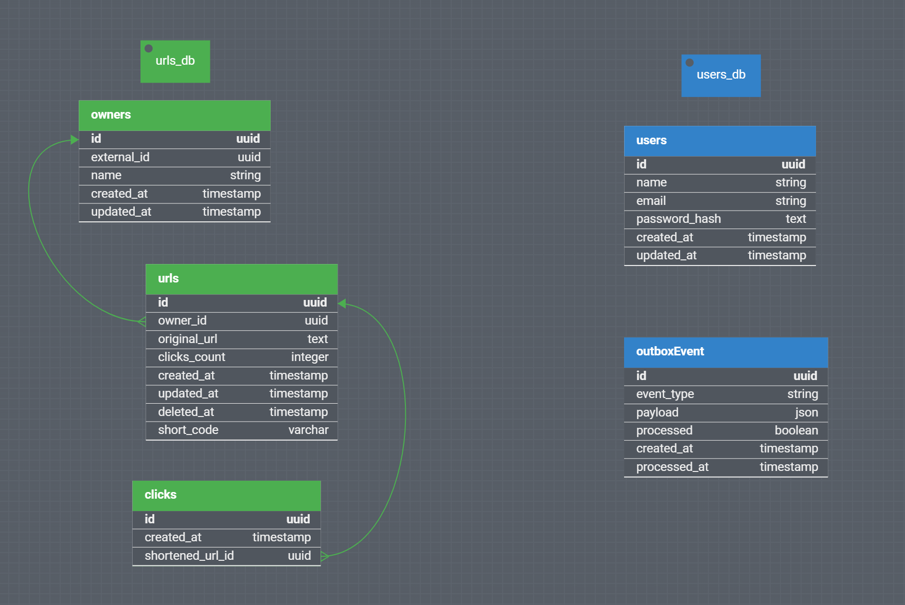

# Quick URL - URL Shortener with a Microservices Architecture

## 📌 Overview

Quick URL is a microservices-based application designed for URL shortening and user authentication/management, following modern backend architecture principles like **SOLID**, **Design Patterns**, and **Dependency Inversion**.
It is fully containerized with **Docker** and **Docker Compose**, deployable both locally and to cloud providers with a simple `docker compose up`.

## 📚 Table of Contents

- [Overview](#-overview)
- [Features](#-features)
- [APIs and Databases Deployments](#apis-and-databases-deployments)
- [Tech Stack](#-tech-stack)
- [Database Schema](#-database-schema)
- [API Routes Overview](#-api-routes-overview)
  - [Users API](#users-api-users)
  - [URLs API](#urls-api-urls)
  - [Clicks Redirection](#clicks-redirection)
- [Local Development](#-local-development)
- [Production / Integration Testing](#-production--integration-testing)
- [Production](#-production)
- [CI/CD & Code Quality](#-cicd--code-quality)
- [Environment Variables](#-environment-variables)
- [Improvements & Scaling Considerations](#-improvements--scaling-considerations)
- [Project Structure](#-project-structure)
- [Versioning](#-versioning)
- [Contributing](#contributing)

## ✨ Features

- ✅ **User Authentication**
  - Register and authenticate users via email and password.
  - JWT-based authentication.

- ✅ **URL Shortener**
  - Public endpoint to shorten URLs.
  - Shortened URL limited to 6 characters.
  - If authenticated, URL is linked to the user.

- ✅ **URL Management (Authenticated)**
  - List all URLs created by the authenticated user (including clicks count).
  - Update destination URL.
  - Soft delete URLs (logical deletion).

- ✅ **Clicks Tracking**
  - Accessing a short URL redirects to the original and increments a click counter.

- ✅ **Outbox Pattern**
- For reliable, event-driven communication between services using Kafka (Redpanda) and the Outbox Pattern, ensuring message delivery and consistency even in the face of failures.

- ✅ **Monorepo Architecture with Microservices**
  - Using Npm workspaces and centralized dependencies.

---

### APIs and Databases Deployments

- **Users API:** [https://users-api-9bzk.onrender.com](https://users-api-9bzk.onrender.com)
- **URLs API:** [https://urls-api-533i.onrender.com](https://urls-api-533i.onrender.com)

> ⚠️ Note: Performance may vary on free-tier cloud resources.
> **Deployment Note:**  
> The application is fully functional and ready for production, designed to run entirely containerized via Docker Compose—either locally or on a cloud provider. While I could not simulate a full cloud deployment due to infrastructure constraints, I have tested a production-like environment by deploying each service separately on Render: two databases, two APIs, an API gateway (Kong), and a Kafka (Redpanda) cluster.
>
> On Render, the Kong API Gateway faced limitations related to port binding, so it is not accessible in this environment (though it works as expected with Docker Compose locally). However, you can access all features by using the direct API links above. Please note that, due to free-tier resource limits (especially RAM), you may occasionally experience brief service interruptions, but the APIs will recover automatically.

## 🏗️ Tech Stack

- **Node.js 22.x:** JavaScript runtime for building scalable backend services.
- **TypeScript:** Strongly typed language for safer, more maintainable code.
- **Fastify:** High-performance web framework for APIs and routing.
- **Prisma ORM:** Type-safe database access and migrations with PostgreSQL.
- **PostgreSQL:** Relational database for persistent storage.
- **Kafka (Redpanda):** Distributed messaging for event-driven microservices.
- **Kong API Gateway:** Centralized API management, routing, and security.
- **Vitest:** Fast unit and integration testing framework.
- **ESLint & Prettier:** Code linting and formatting for consistency.
- **Husky:** Git hooks for enforcing code quality pre-commit.
- **Swagger**: API documentation and testing.
- **GitHub Actions:** CI/CD pipelines for linting, building, and testing.
- **Docker & Docker Compose:** Containerization and orchestration for consistent local and cloud deployments.

# Documentations

The APIs documentations can be accessed by visiting the following route:

[**Users API Documentation**](https://users-api-9bzk.onrender.com/swagger)
<br>
[**Urls API Documentation**](https://users-api-9bzk.onrender.com/swagger)

The documentation provides detailed information about the available endpoints, request and response formats, authentication requirements, and example requests and responses. It serves as a valuable resource for understanding and utilizing the functionalities provided by the API.

## 🗄️ Database Schema

A comprehensive database schema has been designed and implemented for this project. It provides a structured representation of the tables and relationships in the database.

To visualize the model of the database tables, refer to the following image:



## 🔗 API Routes Overview

### Users API (`/users`)

| Method | Path                  | Description         |
| ------ | --------------------- | ------------------- |
| POST   | `/users`              | Register a new user |
| POST   | `/users/authenticate` | Authenticate a user |

### URLs API (`/urls`)

| Method | Path        | Auth  | Description                                   |
| ------ | ----------- | ----- | --------------------------------------------- |
| GET    | `/urls`     | ✅    | List user's URLs + clicks                     |
| POST   | `/urls`     | ✅/❌ | Shorten a URL (link to user if authenticated) |
| PATCH  | `/urls/:id` | ✅    | Update a URL's destination                    |
| DELETE | `/urls/:id` | ✅    | Soft delete a URL                             |

### Clicks Redirection

| Method | Path           | Description                            |
| ------ | -------------- | -------------------------------------- |
| GET    | `/:short_code` | Redirect to original URL & track click |

---

Perfeito! Aqui está a seção revisada, diferenciando melhor o fluxo de desenvolvimento local do uso do Docker Compose para testes integrados:

---

## 🐳 Local Development

### Prerequisites

- Node.js v22.x
- Docker + Docker Compose
- Npm

<br>

> **Note:** All commands should be run from the project root directory.

### Install dependencies

```bash
npm install
```

### Setup Local Databases (Postgres)

You can either:

- Use your own PostgreSQL instances and configure the `.env` files in `apps/users/.env` and `apps/urls/.env`, **OR**
- Spin up the databases and Kafka broker using Docker Compose:

```bash
docker-compose up database_users database_urls redpanda
```

> This will not run the APIs — only the infrastructure services.

### Run Database Migrations

Once databases are running, apply the migrations:

```bash
npm run prisma:migrate:dev:all
```

### Generate Prisma clients

```bash
npm run prisma:generate:all
```

### Start APIs in Development Mode

```bash
npm run dev:all
```

Or individually:

```bash
npm run dev:users
npm run dev:urls
```

> Tip: For any command ending with `:all`, you can target a specific API by substituting `all` with `users` or `urls`.

### Running Tests

```bash
npm test            # Run unit tests on all apps
npm test:coverage
```

---

## 🚢 Production / Integration Testing

To run the **entire environment including APIs, databases, Kafka, and Kong API Gateway**:

```bash
docker-compose up -d
```

This is useful for **integration testing** or when running everything in isolation without local dependencies.

> ✅ Ensure your `.env` files are properly configured in `apps/users/.env` and `apps/urls/.env` before running in containers.

### Production Build

```bash
npm run build       # for all
npm run build:users
npm run build:urls
```

### Run APIs in Production Mode

```bash
npm run start:users
npm run start:urls
```

---

Assim fica claro o objetivo de cada comando e ambiente, separando desenvolvimento, integração local e produção. Quer que eu atualize o seu README gerado com esse texto?

## 🚢 Production

### Production Build

```bash
npm run build       # for all
npm run build:users
npm run build:urls
```

### Run in Production Mode

```bash
npm start:users
npm start:urls
```

### Deploy via Docker Compose

```bash
docker-compose up -d
```

> Note: Ensure you have configured your `.env` files in `apps/users/.env` and `apps/urls/.env`.

---

## ⚙️ CI/CD & Code Quality

- ✅ **Pre-commit Hooks:** via Husky
- ✅ **Linting:** with ESLint + Prettier
- ✅ **Commit Messages:** Conventional Commits with Commitlint
- ✅ **GitHub Actions:** build, lint, and test pipelines on Pull Requests
- ✅ **Main branch is protected**

---

## 🌍 Environment Variables

Each service has its own `.env` file for configuration, located at `apps/users/.env` and `apps/urls/.env`.

Below is an example of common environment variables:

```env
DATABASE_URL=<your_postgres_connection_string>
JWT_SECRET=<your_jwt_secret>
KAFKA_BROKER=<your_kafka_broker_address>
```

> - Make sure to set strong secrets and valid connection strings.
> - Refer to each service's README or `.env.example` for all required variables.
> - Never commit your `.env` files to version control.

---

## 📌 Improvements & Scaling Considerations

- [ ] Implement OpenAPI or Swagger documentation
- [ ] Kubernetes manifests for production deployments
- [ ] Terraform scripts for infrastructure provisioning
- [ ] Observability plugins (e.g., Sentry, Prometheus) configurable via env vars
- [ ] Multi-tenant support
- [ ] Rate limiting and caching via Kong or external services
- [ ] Load balancing APIs horizontally

---

## 🗏️ Project Structure

```
quick-url/           # Monorepo root directory
️️️️️
️ apps/
️   ├️️ users/          # User management API
️   └️️ urls/           # URL shortener API
️
️ kong/               # Kong declarative configuration
️
️ docker-compose.yml  # Full local dev environment
️ package.json        # Root scripts and configs
️ README.md           # Project documentation
```

---

## ✅ Versioning

Git tags are used to version releases:

```
v0.1.0   Release 0.1.0: authentication created
v0.2.0   Release 0.2.0: URL shortener created
v0.3.0   Release 0.3.0: user operations in the shortener
v0.4.0   Release 0.4.0: allow access to shortened URLs and track hits
v0.5.0   Release 0.5.0: allow unique access by API gateway
```

## Contributing

Contributions are welcome! If you have any improvements or bug fixes, feel free to submit a pull request. Additionally, I'm open to suggestions, ideas, or just having a conversation. Feel free to reach out to me through the following channels:

- Email: matheussvini@outlook.com
- LinkedIn: [linkedin.com/in/mvsd](https://linkedin.com/in/mvsd)
